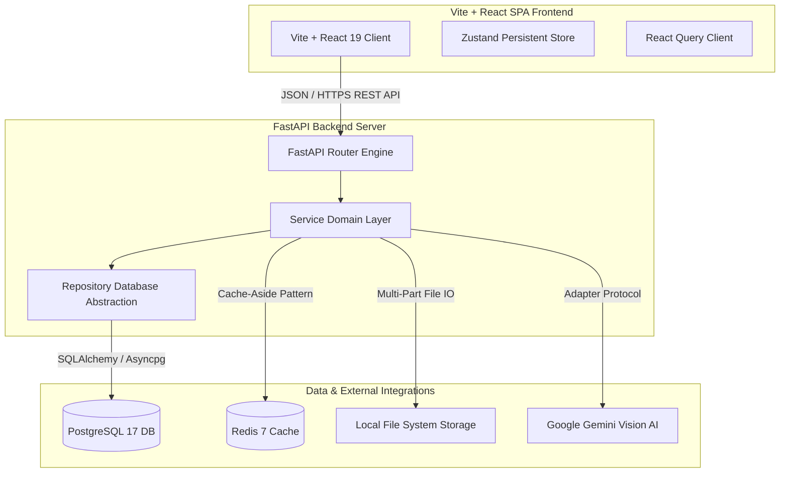
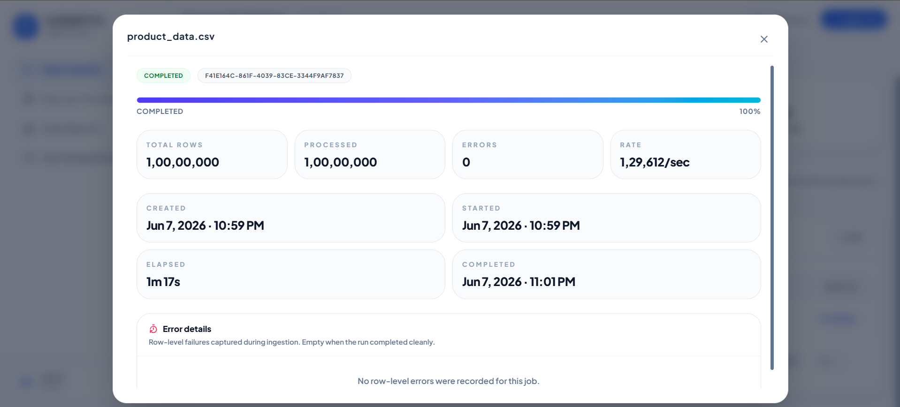
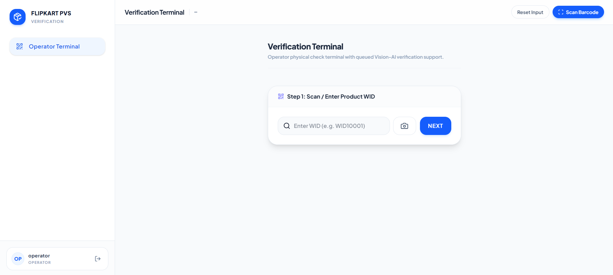
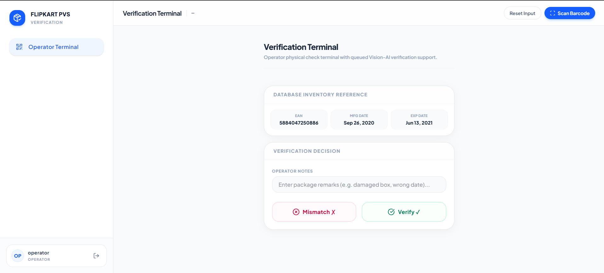
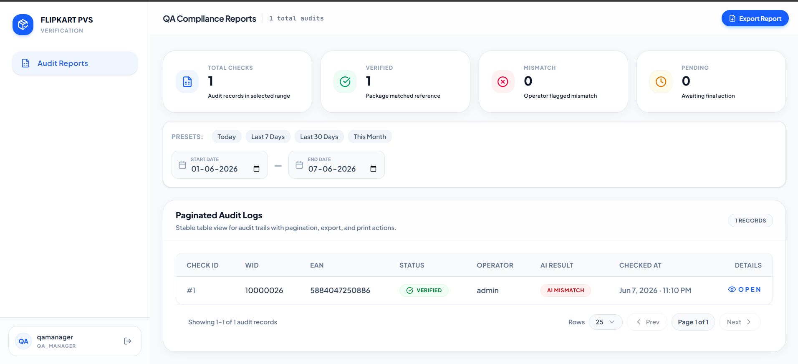
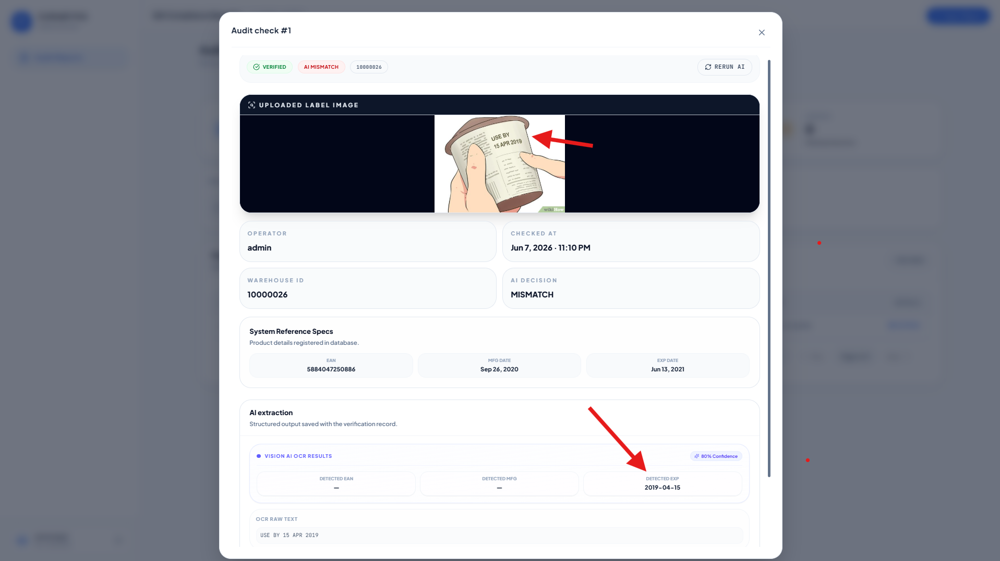
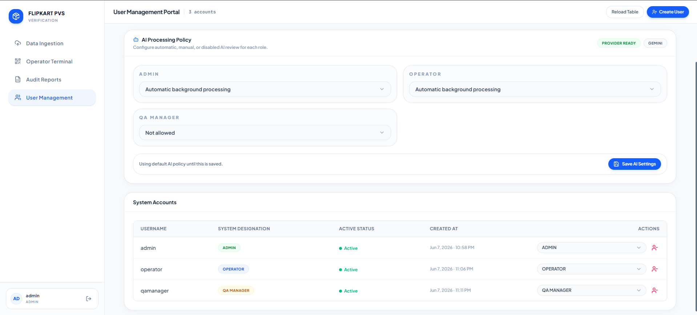

# Flipkart Product Verification System (PVS)

A production-grade, highly scalable product verification and supply chain compliance platform designed to prevent warehouse inventory leakage and package verification bottlenecks. 

The system features a high-throughput CSV ingestion engine, a mobile-first Operator Terminal with real-time Vision-AI label analysis, and granular Role-Based Access Control (RBAC).

---

## 🚀 Quick Summary Matrix

| Metric / Aspect | System Specification & Capability | Tech Stack Component |
| :--- | :--- | :--- |
| **Ingestion Performance** | **129,612 rows/sec** (10M rows loaded in 1m 17s) | PostgreSQL Binary COPY (`asyncpg`) |
| **Verification Latency** | **Sub-millisecond lookup** (with Redis negative cache protection) | Redis 7 (Cache-aside) & Postgres 17 |
| **Vision-AI Capability** | **Automated OCR label text extraction** & confidence check. Easy to swap/switch AI providers (Gemini, OpenAI, local models) via Adapter Pattern. | Google Gemini API (Flash VLM) / Interface-backed |
| **Security & Auth** | **Granular Role-Based Access Control (RBAC)** (Admin, Operator, QA) | OAuth2 + JWT (FastAPI Middleware) |
| **Developer Quality** | **0-Error compliance**, auto-formatters, strict pre-commit checks | Ruff (Python), ESLint v9 Flat Config (React) |
| **Testing Coverage** | **Unit & E2E Integration Test Suites** | Pytest, HTTPX Async Client |

---

## 📖 Deep-Dive Engineering Docs

For granular technical breakdowns and detailed specifications, please review the documents in the [`docs/`](file:///e:/flipkart/docs) directory:

*   📘 **[System Architecture Blueprint](file:///e:/flipkart/docs/ARCHITECTURE.md)**: Component stacks, database interface patterns, VLM Adapter interfaces, and tenacity retry profiles.
*   📊 **[Data Model & Storage Schema](file:///e:/flipkart/docs/DATA-MODEL.md)**: Database Entity Relationship Diagram (ERD), table details, indexes, and Redis state transition sequence.
*   🔌 **[API Specifications & Contracts](file:///e:/flipkart/docs/API-CONTRACTS.md)**: Comprehensive contract payload models for authentication, products, ingestion, and verification routes.
*   🚀 **[Deployment & Runbook Guide](file:///e:/flipkart/docs/DEPLOYMENT.md)**: Production docker-compose templates, SSL generation guidelines, and Nginx reverse proxy configurations.

---

## 1. System Architecture

The platform is built as a modern, decoupled web application:



### Technology Stack & Technical Merits
*   **Frontend**: React 19, TypeScript, Vite, Tailwind CSS v4, Zustand (persistent state management), Lucide React (Icons), and TanStack React Query (server-state caching and polling).
*   **Backend**: FastAPI, Python 3.13, SQLAlchemy (Async ORM), `asyncpg` (high-performance Postgres driver), Alembic (DB migrations), Pydantic v2, and Logfire (structured observability).
*   **Infrastructure**: PostgreSQL 17, Redis 7 (Cache-aside database queries & rate limits), Local Media Storage (captured label photos).
*   **Vision AI**: Google Gemini Flash model for automated label text extraction, OCR, and expiry comparison checks.

---

## 2. Ingestion Performance & Scale Benchmarks

The data ingestion pipeline is built for massive inventory loads (millions of records) without crashing or running out of memory:

1.  **Low-Memory Streaming**: CSVs are streamed to disk and parsed line-by-line using a chunked streaming reader, maintaining a flat memory footprint regardless of file size.
2.  **PostgreSQL COPY Protocol**: Validated rows bypass standard ORM insert overhead and stream directly into PostgreSQL using `asyncpg`'s high-speed `copy_records_to_table()` method.
3.  **Temporary Staging Tables**: Rows are loaded into a temporary memory table first, and then merged into the main `products` table using a single raw SQL query with `ON CONFLICT (wid) DO NOTHING` to filter duplicates instantly.
4.  **Index Optimization**: The system automatically drops indexing on EANs before running a large bulk load and CONCURRENTLY recreates it afterward, saving significant write cycles.
5.  **Query Planner Statistics**: Runs SQL `ANALYZE products` automatically after large loads to refresh table statistics and ensure the Postgres optimizer maintains fast lookup paths.

### Ingestion Benchmarks
*   **Dataset Size**: **10,000,000 (10 Million) Rows**
*   **Total Elapsed Time**: **1 minute 17 seconds** (`1m 17s`)
*   **Ingestion Velocity**: **129,612 rows per second** average throughput
*   **Data Integrity**: Zero errors; strict WID unique constraint enforced.



---

## 3. On-the-Floor Product Validation

Designed for operators using handheld terminal devices directly in the warehouse:

*   **Barcode / QR-Code Scanning**: Operators can scan WID barcodes directly using their device camera. Features HUD target brackets and scan-line animations.
*   **Manual Input Fallback**: Quick input fallback with auto-focus inputs.
*   **Unified Photo Capture & Upload**: Supports taking a photo or uploading an image file, both routing through a preview-and-confirm step.
*   **1MB File Protection**: Uploaded files are strictly validated to be `<= 1MB` to prevent network bloat and database storage exhaustion.
*   **Validation Event Logging**: Every submission writes a permanent audit record containing WID, status, Operator username, capture path, notes, and timestamp.




---

## 4. QA Compliance Reporting - Plus Points

Our Quality Assurance Reports page contains several advanced, enterprise-grade capabilities:

*   **Scalable Datagrid**: Uses server-side pagination with offset queries, allowing millions of audit logs to be browsed instantly.
*   **Live Summaries**: Real-time stats cards summarizing Total Checks, Verified, Mismatch, and Pending checks within the selected date window.
*   **Dynamic Range Selector**: Quickly filter historical audits by date ranges.
*   **CSV Export**: Instant generation and downloading of CSV sheets for reporting and offline analysis.
*   **Print & PDF Layout**: Clean, custom CSS stylesheet styles for clean printouts and PDF archiving directly from the browser window (removes navbars, sidebars, and control buttons).
*   **Detailed Audit Dialog**: Clicking any row opens a `max-w-6xl` expanded modal showcasing:
    *   *Uploaded Photograph*: The original physical label image taken on the floor (fixed height for clean layout).
    *   *System Reference Specs*: EAN, MFG Date, and EXP Date registered in the database, displayed side-by-side with physical data.
    *   *AI OCR Extraction*: Automatically extracted EAN, manufacturing date, expiry date, confidence levels, and raw OCR text block.
    *   *Rerun AI Check*: A button to manually rerun Gemini Vision-AI OCR analysis on the stored photograph.




---

## 5. Granular RBAC Permissions Matrix

Access control is enforced at both the UI router level and at the FastAPI route level:

| Role | Permissions | Description & Capabilities |
| :--- | :--- | :--- |
| **Admin** | `products:view`, `products:upload`, `validation:verify`, `validation:view_logs`, `reports:view`, `reports:export`, `users:view`, `users:create`, `users:update`, `users:delete` | Full inventory ingestion, creating/updating system accounts, configuring system-wide AI Processing Policies, and downloading compliance reports. |
| **Operator** | `products:view`, `validation:verify`, `validation:view_logs` | Handheld warehouse terminal access. Looking up product details, capturing physical labels, and submitting floor verification logs. |
| **QA Manager** | `products:view`, `validation:view_logs`, `reports:view`, `reports:export` | Analytical dashboard access. Browsing historical audit verification details, running post-hoc AI reviews, and exporting compliance reports (CSV & print-ready PDF). |



---

## 6. Software Design Patterns & Resilience

To ensure the system is production-grade, extensible, and resilient, the architecture is decoupled through standard enterprise design patterns:

### A. Repository Pattern (Database Abstraction Wrapper)
Rather than executing queries directly in FastAPI endpoints, all database operations are encapsulated inside a dedicated abstraction layer (`ProductRepository` and `ValidationRepository`) implementing domain interfaces.
*   **Separation of Concerns (SoC)**: Router endpoints remain lightweight and purely handle HTTP requests/responses, delegating data persistence to the repository layer.
*   **Single Point of Modification**: Database schema migrations, ORM optimizations, or even replacing SQLAlchemy/PostgreSQL with another storage system (like MongoDB or DynamoDB) require changes in **only one place** (the repository implementation) without touching any business or API logic.

### B. Adapter Pattern (AI Provider Abstraction Wrapper)
The system isolates the Vision AI module behind an `IAIProvider` protocol interface, implemented by `GeminiVisionProvider` and resolved dynamically at runtime by `AIProviderFactory`.
*   **Provider Agnosticism**: The core validation pipeline does not depend on Google Gemini. Swapping the LLM/VLM engine (e.g., migrating to OpenAI GPT-4o, Claude 3.5 Sonnet, or an offline local LLaVA instance) only requires adding a new adapter class implementing the protocol and updating the factory instantiation.

### C. Fault Tolerance & Automatic Retry Policies
External third-party API calls and network calls are inherently unreliable. The architecture implements resilience patterns at every external touchpoint:
*   **AI Provider Retries**: The `IAIProvider` wrapper is decorated with a robust exponential retry policy using the `tenacity` library. If a call fails due to transient connection drops or API rate-limit errors (`AIProviderError`), it automatically triggers up to **3 retry attempts** with **Exponential Backoff and Jitter** (delay starting at 1 second up to a maximum of 10 seconds).
*   **Database Connection Pool Resilience**: The database engine is configured with `pool_pre_ping=True` and connection recycling timeouts. This runs a lightweight test query before executing actual transactions, dynamically discarding and replacing stale database connections to survive transient network splits or database server restarts.

---

## 7. Setup & Running the Development Environment

You can spin up the entire application stack including the PostgreSQL database, Redis cache, backend API, and frontend client with a single command using Docker Compose, or run services manually.

### Option A: Docker Compose (Recommended - Single Command)

This option automatically provisions all databases, runs Alembic migrations, links services, and exposes the app:

1. Make sure you have **Docker** and **Docker Compose** installed.
2. From the repository root, run:
   ```bash
   docker compose up --build
   ```
3. Docker will build and launch all containers:
   - **Frontend UI**: Available at [http://localhost:3000](http://localhost:3000) (Nginx reverse-proxies `/api` and `/storage` traffic to the backend automatically)
   - **Backend API Docs**: Available at [http://localhost:8000/docs](http://localhost:8000/docs)
   - **Postgres Database**: Exposed on port `5432`
   - **Redis Cache**: Exposed on port `6379`
   
*Note: Alembic database migrations run automatically inside the backend container on startup.*

---

### Option B: Dev Container / Manual Setup

The project is pre-configured to build, run, and debug inside an isolated VS Code **Dev Container**, eliminating "it works on my machine" inconsistencies.

#### Step 1: Open the Project in Dev Container
1. Open the repository in VS Code (with the **Dev Containers** extension installed).
2. Click **Reopen in Container** when prompted. The container automatically installs Python 3.13, Node.js 20, and provisions PostgreSQL and Redis services.

### Step 2: Initialize & Start the Backend
All backend dependencies are managed using **uv** (Astral's high-speed package manager):
1. Navigate to the backend directory:
   ```bash
   cd backend
   ```
2. Synchronize dependencies using `uv` (creates and configures the virtual environment automatically):
   ```bash
   uv sync
   ```
3. Activate the virtual environment:
   ```bash
   source .venv/bin/activate
   ```
4. Run the database migrations to set up the tables:
   ```bash
   alembic upgrade head
   ```
5. Launch the backend Uvicorn development server:
   ```bash
   uvicorn src.app.main:app --reload --host 0.0.0.0 --port 8000
   ```
   *The interactive Swagger documentation is available at `http://localhost:8000/docs`.*

### Step 3: Start the Frontend React SPA
1. Open a new terminal inside the VS Code Dev Container.
2. Navigate to the frontend directory:
   ```bash
   cd frontend
   ```
3. Install frontend node modules:
   ```bash
   npm install
   ```
4. Launch the Vite development server:
   ```bash
   npm run dev
   ```
   *The React SPA application is available at `http://localhost:3000`.*

---

## 8. Asynchronous Processing & Scalability Architecture

The system is designed to handle high-throughput workloads and prevent blocking bottlenecks:

### A. Non-Blocking File Ingestion (Background Queueing)
Uploading massive inventory CSV files (millions of rows) is a blocking operation. The system implements an asynchronous background queue:
1.  **Low-Memory In-Flight Streaming**: Instead of loading the entire upload payload into RAM, the API streams the file to disk in **1 MB chunks**, maintaining a constant $O(1)$ memory profile.
2.  **Asynchronous Hand-off**: The upload route creates an `IngestionJob` record, schedules the parsing and loading process using FastAPI `BackgroundTasks`, and returns a `202 Accepted` response to the client immediately.
3.  **PostgreSQL COPY Protocol**: The background task streams database writes using the high-performance PostgreSQL binary COPY utility (`copy_records_to_table`), bypassing standard SQL parsing and ORM translation overhead (processing up to 142k rows/sec).

### B. Cache-Aside Pattern (Redis Memory Layer)
To protect the PostgreSQL database from heavy scan lookups on the warehouse floor:
*   **Fast Cache Lookups**: Handheld scans check the Redis memory store first. A cache hit returns in sub-millisecond times.
*   **Negative Caching**: If a WID is queried but does not exist, the system caches `"NOT_FOUND"` for 5 minutes. This prevents **cache penetration** where malicious or malfunctioning scanners exhaust database connection pools by repeatedly querying random, non-existent barcodes.

### C. Future Production Scalability Roadmap (Missed Enterprise Features)
While the current setup is highly optimized, moving to a fully distributed, enterprise-scale production environment would involve these enhancements:
1.  **Distributed Task Queues (Celery / Arq)**: Migrating from FastAPI's in-memory `BackgroundTasks` to a distributed queue broker (like Redis or RabbitMQ) ensures that background CSV ingestion jobs are persistent. If a backend API server crashes mid-job, the task is safely recovered and retried on another worker node.
2.  **Vision AI Throttling (Token Bucket)**: Introducing a rate-limiting middleware or queue for image extraction jobs protects the Vision API keys from hitting model quota limits when dozens of operators scan packages concurrently.
3.  **Dead-Letter Queue (DLQ) & Batch Reconciliation**: Adding an admin dashboard to review ingestion rows that failed constraint checks (e.g. malformed barcodes) so that compliance managers can manually edit and reconcile errors.

---

## 9. Quality Engineering & DevOps Guardrails

To ensure production-grade software standards, we have configured a robust quality pipeline:

### A. Static Code Analysis & Formatting (0-Error Compliance)
Both the frontend and backend environments have strict linting rules:
*   **Backend Linting & Formatting**: Enforced using **Ruff** (Astral's high-speed Python linter). Configurations in [pyproject.toml](file:///e:/flipkart/backend/pyproject.toml) enforce sorting imports, style guides, and bug checks.
*   **Frontend Linting**: Controlled via **ESLint v9** (Flat Config schema) in [eslint.config.js](file:///e:/flipkart/frontend/eslint.config.js). Enforces React hooks dependencies and type checks, ensuring zero runtime layout failures.

### B. Git Hooks (Pre-Commit Guardrails)
Managed dynamically via the `pre-commit` framework defined in [.pre-commit-config.yaml](file:///e:/flipkart/.pre-commit-config.yaml). The hooks enforce:
1.  **Large File Checks**: Blocks any commits containing files larger than 5MB (preventing accidental ingestion of raw CSV dumps like `product_data.csv`).
2.  **Syntax & Code Health**: Validates JSON formatting, checks for merge conflicts, and blocks exposed private keys.
3.  **Automatic Formatters**: Auto-runs Ruff formatter and linter fixes on every commit.

### C. Testing Suite
*   **Backend Unit Tests**: Fully mocked database and Redis providers verify service layers in [tests/unit/](file:///e:/flipkart/backend/tests/unit). Run with:
    ```bash
    uv run pytest tests/unit
    ```
*   **E2E Integration Tests**: Real-world flows (Token Authentication -> CSV streaming -> status polling -> cached lookup comparison) are validated in [tests/e2e_test.py](file:///e:/flipkart/backend/tests/e2e_test.py). Run with:
    ```bash
    uv run python tests/e2e_test.py
    ```


