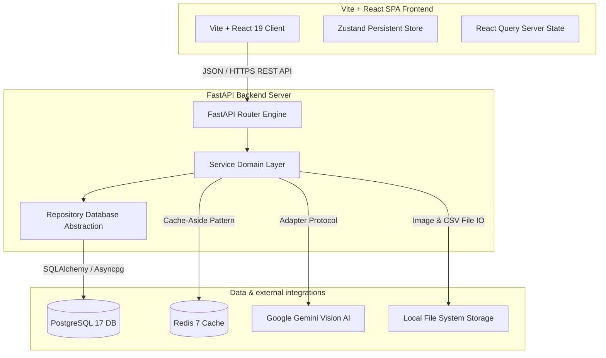
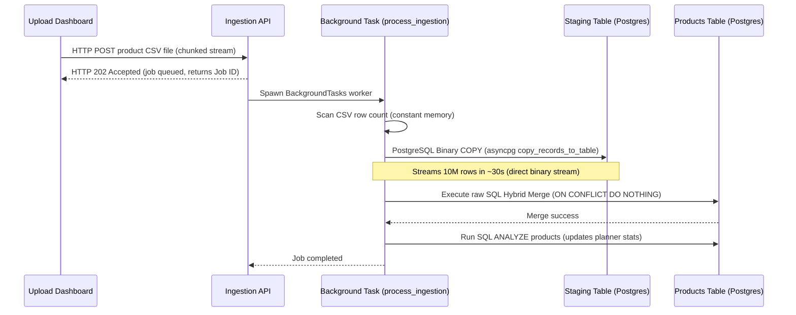
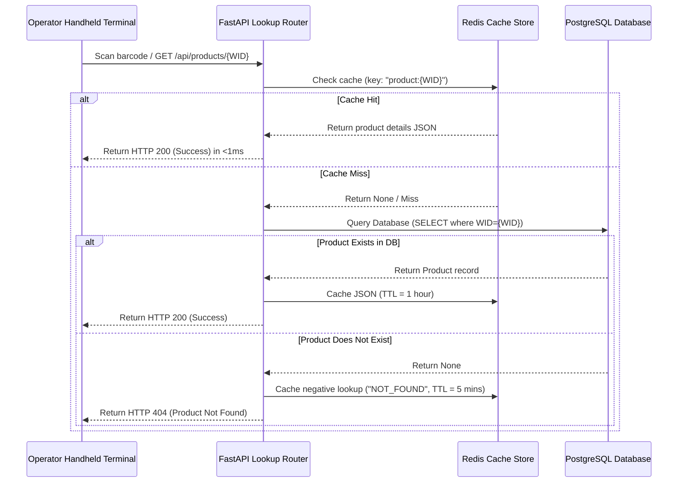

# System Architecture Guide

This document details the software design patterns, architectural boundaries, and performance patterns of the **Flipkart Product Verification System (PVS)**.

---

## 1. High-Level Architecture Component Stack

The platform is designed around a decoupled, three-tier architecture:

---

## 2. Decoupled Design Patterns & Extensibility

### A. Repository Pattern (Database Abstraction)
*   **Purpose**: Isolate core business and API services from raw SQL and ORM queries.
*   **Files**:
    *   Interface: `src/domain/interfaces/repositories.py`
    *   Implementations: `src/products/repository.py`, `src/validation/repository.py`
*   **Merits**: Swapping PostgreSQL for another engine (e.g. MongoDB, DynamoDB) or optimizing queries only requires updates in the repository class. No router or business logic is affected.

### B. Adapter Pattern (AI Provider Agnosticism)
*   **Purpose**: Decoupled AI labels parsing logic so the system is provider-agnostic.
*   **Files**:
    *   Interface: `src/domain/interfaces/ai_provider.py` (defines `IAIProvider` protocol)
    *   Implementations: `src/infrastructure/ai/gemini.py`
    *   Factory resolving logic: `src/infrastructure/ai/factory.py`
*   **Merits**: Swapping Google Gemini for OpenAI GPT-4o, Claude 3.5 Sonnet, or an offline local model (like LLaVA) simply requires writing a new class implementing the interface and updating the Factory configuration.

### C. Fault Tolerance & Automatic Retry Policies
*   **Exponential Jitter Retries**: The Gemini Vision API provider calls are wrapped with `tenacity` retry loops. On transient exceptions (e.g. rate limit HTTP 429), it automatically retries up to **3 times** with exponential backoff and randomized jitter to prevent API key quota exhaustion.
*   **Database pre-ping connection pool**: Database connections run `pool_pre_ping=True` to automatically discard stale database sockets and recover from transient network splits.

---

## 3. High-Throughput Ingestion & Performance Patterns

### A. Constant $O(1)$ Memory CSV Streaming
Traditional CSV parsers load the entire payload into RAM, causing memory exhaustion and server failure on files containing millions of rows.
1.  **FastAPI Chunked Streamer**: Streams uploads in **1MB chunks** directly to disk storage, bypassing RAM.
2.  **Binary Chunk Scanning**: Counts row newlines inside the file by scanning raw binary byte arrays in 10MB blocks, calculating the exact total rows in milliseconds without memory load.

### B. Postgres COPY Protocol & Hybrid Merge
Standard ORM inserts create high overhead by compiling SQL per row. Our system streams data directly into the DB:

---

## 4. Product Lookup Cache-Aside Flow

To maintain sub-millisecond barcode lookup times for floor operators, lookups use Redis as a caching layer:

*(Note: Negative Caching prevents **Cache Penetration Attacks/Issues** where invalid scans query missing barcodes repeatedly and exhaust Postgres connection pools).*
