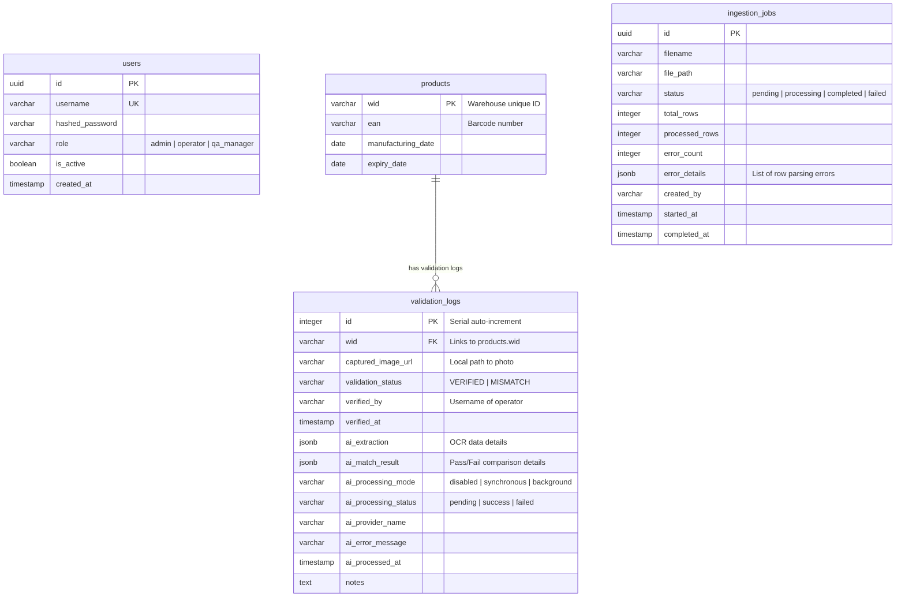
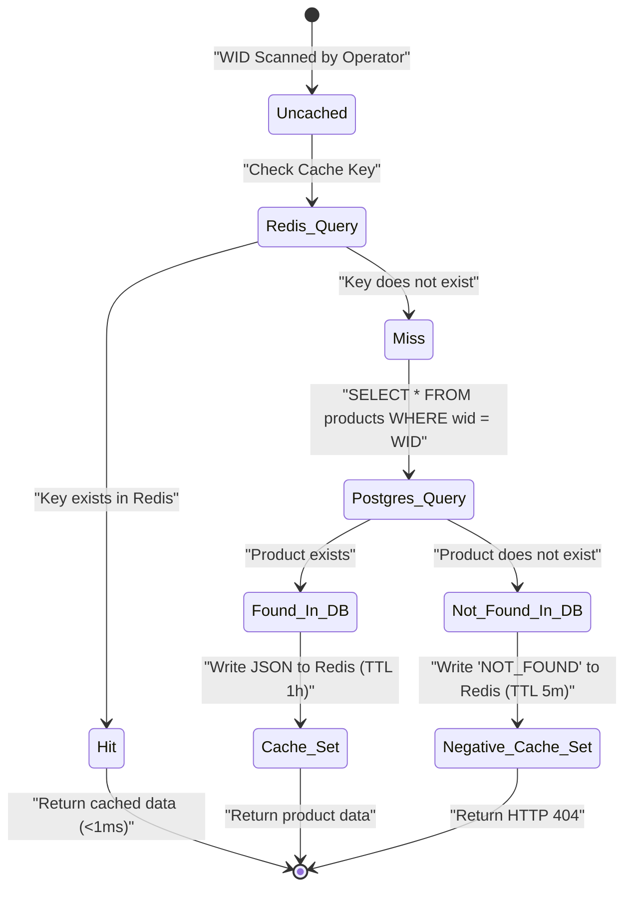

# Data Model & Storage Schema

The Flipkart Product Verification System utilizes **PostgreSQL 17** for persistent, relational metadata storing and **Redis 7** as an ephemeral cache-aside memory store.

---

## 1. PostgreSQL Schema Design

All tables are defined in Python using SQLAlchemy Declarative models. Below are the physical layouts.

---

### A. Core Inventory Table (`products`)
Houses reference inventory details. For performance, EAN matches are heavily indexed.
*   **WID (Primary Key)**: Encased index for sub-millisecond point queries.
*   **EAN Index**: Indexed concurrently using B-Tree indexing (`ix_products_ean`) to speed up EAN grouping and analytics searches.

### B. Ingestion Job Log (`ingestion_jobs`)
Tracks bulk CSV loading jobs and reports progress and row-level parsing errors.
*   **error_details (JSONB)**: Captures up to 200 row-level parsing errors (row numbers, field names, error messages) allowing compliance managers to review format anomalies.

### C. Validation Log Table (`validation_logs`)
Captures all physical packages inspection logs recorded by operators on the warehouse floor.
*   **captured_image_url**: Holds path to stored photographs (validations `<= 1MB` are enforced).
*   **ai_extraction / ai_match_result (JSONB)**: Store raw JSON structures from Gemini API containing OCR parsed dates, confidence values, and match boolean statuses.

---

## 2. Redis Caching Schema (Cache-Aside Engine)

To protect the Postgres instance from heavy floor queries, points lookups check Redis first.

| Cache Key Pattern | Data Structure | Purpose | TTL (Expiry) |
| :--- | :--- | :--- | :--- |
| **`product:{WID}`** | String (JSON Payload) | Holds serialized product data (WID, EAN, Mfg/Exp dates) for fast client lookups. | **3600 seconds** (1 Hour) |
| **`product:{WID}`** (negative) | String (`"NOT_FOUND"`) | Negative caching for invalid scans to prevent connection pool exhaustion. | **300 seconds** (5 Minutes) |

### Cache State Transitions

